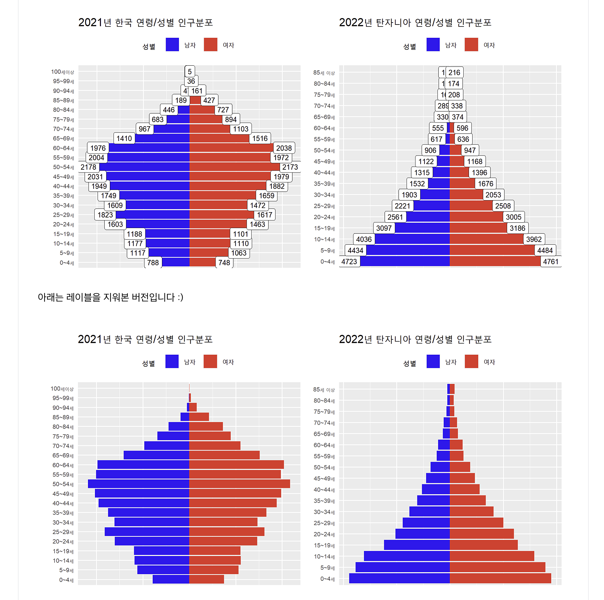

```{r setup, include=FALSE}
knitr::opts_chunk$set(echo = TRUE)
library(bbplot)
library(tidyverse)
library(showtext)
showtext_auto()
library(gt)

```

## 1장 그래프

This is an R Markdown document. Markdown is a simple formatting syntax for authoring HTML, PDF, and MS Word documents. For more details on using R Markdown see <http://rmarkdown.rstudio.com>.


### 1-1 Dataset
```{r cars, cache=TRUE, echo=TRUE}

mpg

```
<br>

### 1-2 ggplot 막대그래프

You can also embed plots, for example:

```{r}

#기본
ggplot(data = mpg, 
  aes(x = class,
      y = after_stat(count))) +
    geom_bar(stat = "count")

#색깔
ggplot(data = mpg, 
  aes(x = class,
      y = after_stat(count),
    fill = drv)) +
  geom_bar(stat = "count")

#그래프 옵션
ggplot(data = mpg, 
  aes(x = class,
    y = after_stat(count),
    fill = drv)) +
  geom_bar(stat = "count",
    position = "dodge")

#그래프 비율
ggplot(data = mpg, 
  aes(x = class,
    y = after_stat(count),
    fill = drv)) +
  geom_bar(stat = "count",
    position = "fill")

#그래프 비율
ggplot(data = mpg, 
  aes(x = class,
    y = after_stat(count),
    fill = drv)) +
  geom_bar(stat = "count",
    position = "fill") +
  scale_fill_brewer(palette = "Set1")

#축 변환
ggplot(data = mpg, 
  aes(x = class,
    y = after_stat(count),
    fill = drv)) +
  geom_bar(stat = "count") +
  scale_fill_brewer(palette = "Set1")

#
mpg |> count(manufacturer, class) |> 
  ggplot(aes(x = manufacturer, y = n)) + 
  geom_bar(stat = "identity") +
  coord_flip() +
  facet_wrap(.~class, scales = "free")
  
```

```{r text, warning=FALSE }

#테마
ggplot(data = mpg, 
  aes(x = class,
    y = after_stat(count),
    fill = drv)) +
  geom_bar(stat = "count",
    position = "dodge",
    show.legend = F) +
  bbc_style() +
  theme(axis.text.x = element_text(size = 13)) +
  labs(title = "자동차 종류에 따른 연비 비교", 
    subtitle = "bbc 테마")


```


### 1-3 ggplot 산점도
```{r }

#기본
mpg |> ggplot(aes(x = displ, y = hwy)) +
  geom_point(stat = "identity")

#색깔
mpg |> ggplot(aes(x = displ, y = hwy, color = drv)) +
  geom_point(stat = "identity")

#면분할
mpg |> ggplot(aes(x = displ, y = hwy, color = drv)) +
  geom_point(stat = "identity") +
  facet_wrap(.~drv, nrow = 2)

#면분할 응용
mpg |> ggplot() +
  geom_point(data = select(mpg, -drv), 
    aes(x = displ, y = hwy), 
    color = "grey",
    stat = "identity") +
  geom_point(aes(x = displ, y = hwy, color = drv),
    stat = "identity") +
  facet_wrap(.~drv, nrow = 2)

```

<br><br>

## 3 deploy 데이터 변형

### 5장 EDA

<br>
  
```{r, warning=FALSE}

#원본 53,940개의 다이아몬드 중에 불량품 찾기
diamonds

#개수
diamonds |> ggplot(aes(x = price)) + geom_histogram()

#
diamonds |> 
  ggplot(aes(x = cut)) + 
  geom_bar() +
  geom_label(aes(label = scales::comma(stat(count))), stat = "count") +
  bbc_style()

#오류 찾기
diamonds |> ggplot(aes(x = y, y = after_stat(count))) +
  geom_histogram(stat = "count")

# 이상치
diamonds |> ggplot(aes(x = x, y = y)) +
  geom_point()

```

## 7장 엑셀 파일 불러오기

### 통계청 자료
https://kosis.kr/statHtml/statHtml.do?orgId=101&tblId=DT_1IN1503&conn_path=I2


```{r}
#2021년 통게청 대한민국 인구 분포
read_tsv("./files/people_2021_google.tsv", 
  skip = 1) -> people1_tsv

head(people1_tsv) |> gt()

```

## 7-1 통계청 데이터를 활용한 인구 분포 비교 (피라미드 차트)

```{r, echo=FALSE}

people1_tsv |> select("연령별", "내국인_남자(명)", "내국인_여자(명)") |> 
  rename(남자 = 2,
         여자 = 3) |> slice(2:22) -> people2_rename

people2_rename |> pivot_longer(
  cols = !연령별,
  names_to = "성별",
  values_to = "인구"
) -> people3_pivot

(people3_pivot |> 
  mutate(인구편집 = if_else(성별 == "여자",
                        인구,
                        -1 * 인구),
         num = row_number()) -> people4_편집)

people4_편집 |> 
  ggplot(aes(연령별 |> fct_reorder(num), 
             인구편집)) +
  geom_bar(stat = "identity", aes(fill = 성별)) +
  coord_flip() +
  geom_label(aes(label = round(인구/(1000),0))) +
  theme(axis.title = element_blank(),
        axis.text.x = element_blank(),
        axis.text.y = element_text(size = 15),
        legend.position = "top",
        axis.ticks = element_blank()) +
  scale_fill_manual(values = c("남자" = "blue",
                               "여자" = "red")) +
  labs(title = "2021년 한국 연령/성별 인구분포")
```

<br><br>



<br>


## 9장 피벗

```{r}

mpg |> count(manufacturer, drv) |> 
  pivot_wider(names_from = drv,
    values_from = n)

```


```{r}
mpg |> count(manufacturer, model, class) |> 
  pivot_wider(names_from = class,
    values_from = n)

```


```{r pressure, echo=FALSE}

# 데이터 원본
mpg 

# 제조사
mpg |> count(manufacturer)

# 제조사
mpg |> count(manufacturer, drv)

```

Note that the `echo = FALSE` parameter was added to the code chunk to prevent printing of the R code that generated the plot.

<br><br>

