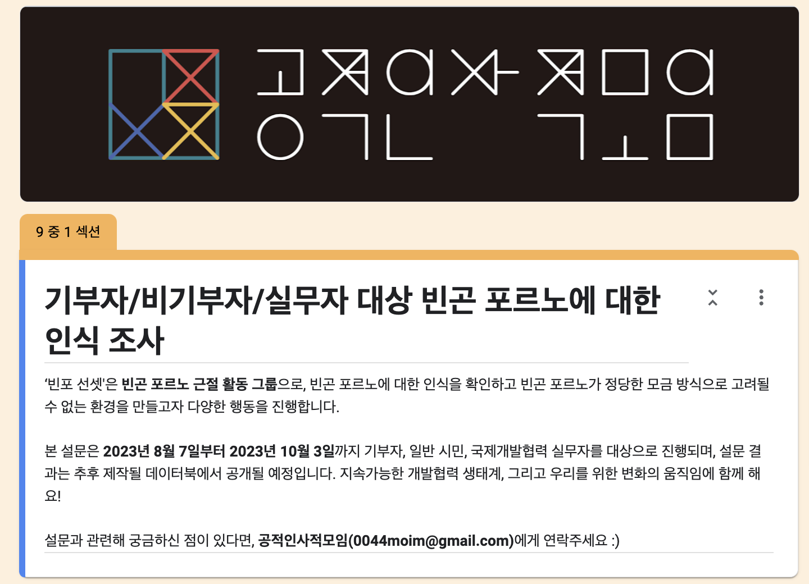

```{r setup, include=FALSE}
knitr::opts_chunk$set(echo = TRUE)
library(tidyverse)


```
<br>

---

<br>




```{r cars, echo=FALSE, eval=FALSE}

googlesheets4::read_sheet("https://docs.google.com/spreadsheets/d/1kWw5IbuS9L9EwX3lfu6gPrLhrnWlBWrXX0k8GfEoEf0/edit?usp=sharing") -> pp_1csv

```

## Including Plots

You can also embed plots, for example:

```{r pressure, echo=FALSE}


```

Note that the `echo = FALSE` parameter was added to the code chunk to prevent printing of the R code that generated the plot.
